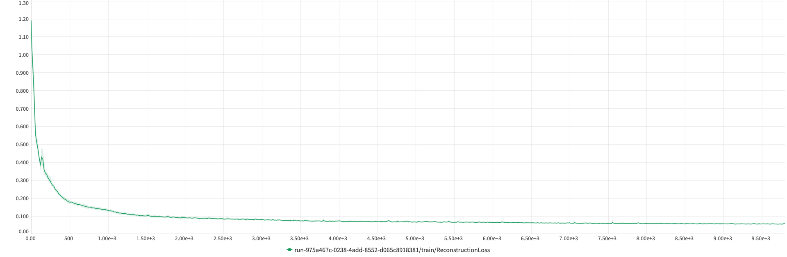
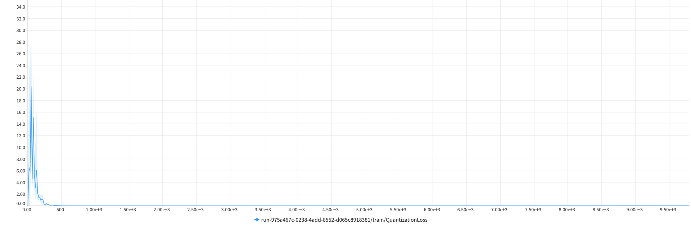
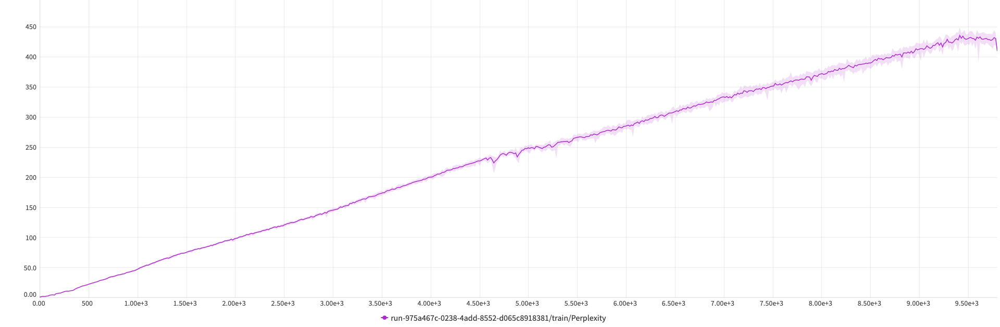
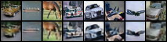

# VQ-VAE

Code adapted from [this notebook](https://colab.research.google.com/github/zalandoresearch/pytorch-vq-vae/blob/master/vq-vae.ipynb#scrollTo=qHUptm5jmleI).

## STATUS: Work In Progress

# Setting up

Create a new python environment. If you have conda installed simply run 
```bash
conda create -n vqvae-pytorch python=3.9 -y && conda activate vqvae-pytorch
```

Once the virtual environment is created you can install all necessary dependencies by running 

```bash
pip install -r requirements.txt
```

# Training results

Logging of metrics and assets was done with the help of the Neptune AI library. 

Below you can see the preliminary results of a benchmark training procedure of the VQ-VAE displaying the reconstruction loss (how well the model is able to re-create inputs) as well as the quantization loss (which measures the difference between the encoded data in its raw and quantized forms).

Reconstruction Error


Quantization Error


Perplexity (Codebook usage)


## Reconstructions

Reconstruction Epoch 0 \


Reconstruction Epoch 5 \


Reconstruction Epoch 10 \


Reconstruction Epoch 25 \


Reconstruction Epoch 50 \

